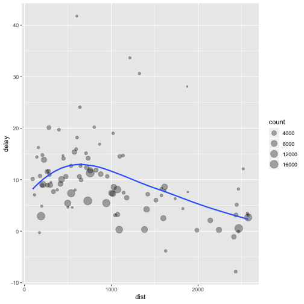

IPI R Workshop: The Basics
========================================================
author: Carlos Calvo Hernandez
date: November 28th, 2018
autosize: true

Basics
========================================================

You can use R as a calculator:

```r
1 / 200 * 30
```

```
[1] 0.15
```

```r
sin(pi / 2)
```

```
[1] 1
```

Basics (cont.)
========================================================

You can create objects with "`<-`"

```r
x <- 3 * 4
y <- sin(pi) * pi
```
This is called an **assignment** statement, all have the form:

```r
object_name <- value
```
Naming Conventions
========================================================

- Object names **MUST** start with a letter
- Can only contain letters, numbers, `_`, and `.`
- Object names should be descriptive.   

```r
i.use.periods  
some_use_snake_case
otherPeopleUseCamelCase
And_aFew.People_RENOUNCEconvention
```

Inspect elements
========================================================
Inspect an object by typing its name

```r
x
```

```
[1] 12
```
Make another assignment:

```r
this.is.a.really.long.name <- 2.5
```

type “this”, press TAB, add characters until you have a unique prefix, then press return.

Inspect elements (rerun commands)
========================================================

Imagine you need to edit a command, ```this.is.a.really.long.name``` should have a value of 3.5 not 2.5.  
- Type "this" the press Cmd/Ctrl + $\uparrow$. This list all the commands you've typed that starts with those letters.
- Use the arrow keys to navigate, then press enter to retype the command.
- Change 2.5 to 3.5 and rerun.

Inspect elements
========================================================

Make another assignment

```r
r.rocks <- 2 ^ 3
```
Let's try to inspect it

```r
r.rock
Error in eval(expr, envir, enclos) : object 'r.rock' not found

R.rocks
Error in eval(expr, envir, enclos) : object 'R.rocks' not found
```

Calling functions
========================================================
incremental: true
Functions are called like this:

```r
function_name(arg1 = val1, arg2 = val2, ...)
```


```r
seq(1,10)
```

```
 [1]  1  2  3  4  5  6  7  8  9 10
```

Using Data
========================================================


```r
flights
```

```
# A tibble: 336,776 x 19
    year month   day dep_time sched_dep_time dep_delay arr_time
   <int> <int> <int>    <int>          <int>     <dbl>    <int>
 1  2013     1     1      517            515         2      830
 2  2013     1     1      533            529         4      850
 3  2013     1     1      542            540         2      923
 4  2013     1     1      544            545        -1     1004
 5  2013     1     1      554            600        -6      812
 6  2013     1     1      554            558        -4      740
 7  2013     1     1      555            600        -5      913
 8  2013     1     1      557            600        -3      709
 9  2013     1     1      557            600        -3      838
10  2013     1     1      558            600        -2      753
# ... with 336,766 more rows, and 12 more variables: sched_arr_time <int>,
#   arr_delay <dbl>, carrier <chr>, flight <int>, tailnum <chr>,
#   origin <chr>, dest <chr>, air_time <dbl>, distance <dbl>, hour <dbl>,
#   minute <dbl>, time_hour <dttm>
```

Data Manipulation
========================================================

The "verbs" from ```dplyr``` package

```r
filter() #Pick observations by their values
arrange() #Reorder the rows
select() #Pick variables by their names
mutate() #Create new variables with functions of existing variables
summarize() #Collapse many values down to a single summary
```

These can all be used with 

```r
group_by()
```
so they operate on the dataset on a group-by-group basis.

Data Manipulation
========================================================

All verbs work similarly:

1. First argument is a data frame (e.g. tibble, data.frame, etc.)
2. The subsequent arguments describe what to do with the data frame, using the variable names (without quotes).
3. The result is a new data frame.

Data Analysis 
========================================================



Data Analysis (Pipeline)
========================================================
source: Data_transformation.R /#5.1 Pipeline/

Data Analysis (Pipeline)
========================================================
incremental: true
A **pipeline** looks like:

```r
delays <- flights %>% 
  group_by(dest) %>% 
  summarise(
    count = n(),
    dist = mean(distance, na.rm = TRUE),
    delay = mean(arr_delay, na.rm = TRUE)
  ) %>% 
  filter(count > 20, dest != "HNL")
```

Behind the scenes: ```x %>% f(y)``` turns into ```f(x, y)```, and ```x %>% f(y) %>% g(z)``` turns into ```g(f(x, y), z)``` and so on.

Scripts
========================================================
source: Data_transformation.R /#Data Transformation Verbs for Dplyr/

Keyboard shortcuts:

```r
Cmd/Ctrl + Enter #executes current expression
Cmd/Ctrl + Shift + S #executes the complete script
Cmd/Ctrl + Shift + P #resends the previously sent chunk from the editor to the console
```

Tibbles
========================================================
Tibbles are data frames, but different from the ```data.frame``` structure from base R. 
They're part of the ```library(tidyverse)``` 

```r
library(tidyverse)
```

To coerce regular data frames into tibbles you can use

```r
as_tibble(iris)
```


Tibbles
========================================================


```r
tibble(
  x = 1:5, 
  y = 1, 
  z = x ^ 2 + y
)
```

```
# A tibble: 5 x 3
      x     y     z
  <int> <dbl> <dbl>
1     1     1     2
2     2     1     5
3     3     1    10
4     4     1    17
5     5     1    26
```

```tibble()``` never changes the type of the inputs (e.g. it never converts strings to factors!), it never changes the names of variables, and it never creates row names.


Tibble vs. data.frame
========================================================
Main differences: printing and subsetting.

- Printing: Tibbles print only the first 10 rows and all the columns that fit on the screen.

```r
tibble(
  a = lubridate::now() + runif(1e3) * 86400,
  b = lubridate::today() + runif(1e3) * 30,
  c = 1:1e3,
  d = runif(1e3),
  e = sample(letters, 1e3, replace = TRUE)
)
```
Need more? You can always use RStudio's data viewer 

```r
nycflights13::flights %>% 
  View()
```


Tibble vs. data.frame
========================================================

- Printing:

```
# A tibble: 1,000 x 5
   a                   b              c      d e    
   <dttm>              <date>     <int>  <dbl> <chr>
 1 2018-11-29 00:01:13 2018-12-15     1 0.715  c    
 2 2018-11-29 02:14:22 2018-12-23     2 0.113  g    
 3 2018-11-29 11:05:54 2018-11-29     3 0.529  v    
 4 2018-11-29 11:18:22 2018-12-13     4 0.447  n    
 5 2018-11-29 02:01:45 2018-12-11     5 0.493  p    
 6 2018-11-28 18:13:51 2018-12-16     6 0.0822 z    
 7 2018-11-28 18:46:55 2018-12-01     7 0.472  s    
 8 2018-11-29 07:05:54 2018-12-09     8 0.642  g    
 9 2018-11-28 15:19:43 2018-12-01     9 0.305  m    
10 2018-11-29 02:06:08 2018-12-15    10 0.246  p    
# ... with 990 more rows
```

Tibble vs. data.frame
========================================================
- Subsetting: To pull out single variables you need the tools: ```$``` and ```[[```. 

```r
df <- tibble(
  x = runif(5),
  y = rnorm(5)
)
df
```

```
# A tibble: 5 x 2
       x      y
   <dbl>  <dbl>
1 0.110  -0.579
2 0.228  -0.343
3 0.0692 -0.713
4 0.851   1.88 
5 0.758   1.11 
```

Tibble vs. data.frame
========================================================
- Subsetting:

```r
# Extract by name
df$x
```

```
[1] 0.11021368 0.22772868 0.06922947 0.85071659 0.75833925
```

```r
df[["x"]]
```

```
[1] 0.11021368 0.22772868 0.06922947 0.85071659 0.75833925
```

```r
# Extract by position
df[[1]]
```

```
[1] 0.11021368 0.22772868 0.06922947 0.85071659 0.75833925
```

Tibble vs. data.frame
========================================================
incremental: true
- Usage in a pipe:

```r
df %>% .$x
```

```
[1] 0.11021368 0.22772868 0.06922947 0.85071659 0.75833925
```

```r
df %>% .[["x"]]
```

```
[1] 0.11021368 0.22772868 0.06922947 0.85071659 0.75833925
```


- Compared to a data.frame, tibbles are more strict: they never do partial matching, and they will generate a warning if the column you are trying to access does not exist.

Tibbles interacting with older code
========================================================
- Some older functions don’t work with tibbles. If you encounter one of these functions, use ```as.data.frame()``` to turn a tibble back to a ```data.frame```.

- The main reason that some older functions don’t work with tibble is the [ function. We don’t use [ much in this book because ```dplyr::filter()``` and ```dplyr::select()``` allow you to solve the same problems with clearer code

- With base R data frames, [ sometimes returns a data frame, and sometimes returns a vector. With tibbles, [ always returns another tibble.

Importing Data
========================================================
- The easiest way to load flat files is with the **readr** package, it's part of the package **tidyverse**
- Most used readr's functions are:
  - read_csv(), read_csv2(), read_tsv(), and read_delim().
  - read_fwf() reads fixed width files. read_table() reads a common variation of fixed width files where columns are separated by white space.
  - read_log() reads Apache style log files.

Importing Data (Readr vs Base R)
========================================================

I like to use ```read_csv()``` rather than the base R function ```read.csv()``` because **readr** functions:
  - Typically are much faster than their base equivalents
  - Produce tibbles, they don’t convert character vectors to factors, use row names, or munge the column names.
  - Are more reproducible.
  
Importing SQL Data
========================================================
To connect to a SQL server you need two packages

```r
require(DBI)
require(RPostgreSQL)
```
Then, the first thing is you have to let R know what's the structure of the server by specifying the driver (e.g. SQlite, SQL, PostgreSQL, etc.)

```r
m <- dbDriver("driver name")
```
By now, you need to have the particular details of the server and create the connection on R

```r
con <- dbConnect(m, host="Name or IP address", port="number", user="username", password="password", dbname="database name")
```

Querying SQL Data
========================================================

When the connection is setup, then the server has to be queried for the data

```r
rs <- dbSendQuery(con, "SELECT * FROM table.name WHERE variable BETWEEN 'value1' AND 'value2'")
```
This sends the query and "downloads" the data to R, but doesn't assign it to any R structure. ```fetch()``` records the queried data into a data frame.

```r
df <- fetch(rs, n = -1)
```
**n = -1** means that all rows queried showed by assigned to ```df```

```r
dbHasCompleted(rs)
```
returns TRUE if all the data queried has being assigned to a structure in R


Importing Pecan Street Data
========================================================
To import the Pecan Street Dataport datasets you need the following script

```r
require(DBI)
require(RPostgreSQL)
m <- dbDriver("PostgreSQL")
  
con <- dbConnect(m, host="dataport.cloud", port="5434", user="Vr5SmRn96HF5", password="HCzasJwPfMjr", dbname="postgres")
rs <- dbSendQuery(con, "SELECT * FROM university.audits_2011 WHERE date_of_audit BETWEEN '01-01-2013' AND '12-31-2013'")
df <- dbFetch(rs, n = -1)
dbHasCompleted(rs)
```
You should use your username and password from the website, but everything else should work the same.

Importing Pecan Street Data (Example)
========================================================

```
  dataid date_of_audit number_of_levels no_bedrooms year_built
1     93    10/14/2011                1           4       1993
2   2749     11/2/2011                2           2       1983
3   2749     11/2/2011                2           2       1983
4   2864    10/20/2011                1           3       1963
         builder conditions_square_foot house_volume_cubic_feet
1 Brighton Homes                   2770                   26592
2        unknown                   1000                    8058
3        unknown                   1000                    8058
4   not assessed                   1973                   15784
  directional_orientation_of_house hvac_service_company utilities_electric
1                                E                 <NA>                  1
2                             West                 <NA>                  1
3                             West                 <NA>                  1
4                               NE                 <NA>                  1
  utilities_natural_gas utilities_propane_gas foundations_type_slab
1                     1                     0                     1
2                     1                     0                     1
3                     1                     0                     1
4                     1                     0                     1
  foundations_type_pier__beam type_of_home_single_family
1                           0                          1
2                           0                          0
3                           0                          0
4                           0                          1
  type_of_home_duplex type_of_home_triplex type_of_home_four_plex
1                   0                    0                      0
2                   1                    0                      0
3                   1                    0                      0
4                   0                    0                      0
  type_of_home_condo type_of_home_town_home
1                  0                      0
2                  0                      0
3                  0                      0
4                  0                      0
  type_of_cooling_system_central_air_condition
1                                            1
2                                            1
3                                            1
4                                            1
  type_of_cooling_system_central_heat_pumps
1                                         0
2                                         0
3                                         0
4                                         0
  type_of_cooling_system_window_unit type_of_cooling_system_other
1                                  0                            0
2                                  0                            0
3                                  0                            0
4                                  0                            0
  number_of_other type_of_cooling_system_no_cooling
1               0                                 0
2               0                                 0
3               0                                 0
4               0                                 0
  type_of_heating_system_central_gas
1                                  1
2                                  1
3                                  1
4                                  1
  type_of_heating_system_central_heat_pump
1                                        0
2                                        0
3                                        0
4                                        0
  type_of_heating_system_wall_furnace
1                                   0
2                                   0
3                                   0
4                                   0
  type_of_heating_system_gas_space_heater
1                                       0
2                                       0
3                                       0
4                                       0
  type_of_heating_system_heat_recovery_system
1                                           0
2                                           0
3                                           0
4                                           0
  type_of_heating_system_electric_strip_heater
1                                            0
2                                            0
3                                            0
4                                            0
  type_of_heating_system_hydronic_space_heater
1                                            0
2                                            0
3                                            0
4                                            0
  description_of_dedicated_ventilation_system thermostats_manual
1                                        <NA>                  0
2                                        <NA>                  0
3                                        <NA>                  0
4                                        <NA>                  0
  thermostats_digital thermostats_programmable thermostats_ae_programmable
1                   0                        1                           0
2                   1                        1                           0
3                   0                        0                           1
4                   1                        0                           0
  fuel_type_gas_water_heater fuel_type_electric_water_heater
1                          0                               0
2                          0                               1
3                          0                               1
4                          1                               0
  fuel_type_solar_water_heater fuel_type_tankless_water_heater
1                            0                               1
2                            0                               0
3                            0                               0
4                            0                               1
  combustion_air_provided timer_attached_to_water_heater
1                       1                              0
2                    <NA>                              0
3                    <NA>                              0
4                       1                              0
  refrigerator_pre_1993_ refrigerator_post_1993 freezer_pre_1993_
1                      0                      1                 0
2                      0                      1                 0
3                      0                      1                 0
4                      0                      2                 0
  freezer_post_1993 dishwasher_pre_1993_ dishwasher_post_1993
1                 0                    0                    1
2                 0                    1                    0
3                 0                    1                    0
4                 1                    0                    1
  clothes_washer_pre_1993_ clothes_washer_post_1993
1                        0                        1
2                        0                        1
3                        0                        1
4                        0                        1
  clothes_dryer_pre_1993_ clothes_dryer_post_1993 pool_pump_pre_1993_
1                       0                       1                   0
2                       0                       1                   0
3                       0                       1                   0
4                       0                       1                   0
  pool_pump_post_1993 pump_timer_pre_1993_ pump_timer_post_1993
1                   0                    0                    0
2                   0                    0                    0
3                   0                    0                    0
4                   0                    0                    0
  standard_toilets_pre_1993_ standard_toilets_post_1993
1                          0                          3
2                          0                          0
3                          2                          0
4                          0                          0
  water_saving_toilets_pre_1993_ water_saving_toilets_post_1993
1                              0                              0
2                              0                              2
3                              0                              0
4                              0                              2
  sprinkler_system_pre_1993_ sprinkler_system_post_1993
1                          0                          1
2                          0                          0
3                          0                          0
4                          0                          1
  hvac_component_1_manufacturer hvac_component_1_model
1                         Amana               RCE60A2D
2                       Goodman                CRT18-1
3                       Goodman                 CK24-B
4                         Rheem             14AJM36A01
  hvac_component_1_capacity_kw hvac_component_1_manufactured_year
1                        17.58                               2003
2                        5.274                               2006
3                        7.032                               1994
4                       10.548                               2010
  hvac_component_2_manufacturer hvac_component_2_model
1                         Amana            GUIC090FAJ0
2                          RUUD              4AGC-045C
3                          RUUD              4AGC-045C
4                         Rheem           RGPT-07EBRQR
  hvac_component_2_capacity_kw hvac_component_2_manufactured_year
1                       26.956                               2003
2                       13.185                               <NA>
3                       13.185                               <NA>
4                         <NA>                               <NA>
               hvac_component_3_manufacturer hvac_component_3_model
1                                       <NA>                   <NA>
2                                       <NA>                   <NA>
3                                       <NA>                   <NA>
4 Navian               tankless water heater                   <NA>
  hvac_component_3_capacity hvac_component_3_manufactured_year
1                      <NA>                               <NA>
2                      <NA>                               <NA>
3                      <NA>                               <NA>
4                      <NA>                               2009
  refigerator_manufacturer refigerator_model refigerator_capacity_kw
1                       GE         PSF26PGWA                    1.27
2                  Kenmore        106.729062                    0.78
3                       GE              <NA>                    <NA>
4                       GE              <NA>                    <NA>
  refigerator_manufactured_year refigerator_nameplate_illegible
1                          <NA>                            <NA>
2                          2003                            <NA>
3                          <NA>                               1
4                          <NA>                               1
  dishwasher_manufacturer dishwasher_model dishwasher_capacity_kw
1                      GE     PDWT380R10SS                  1.188
2                Hotpoint     HDA1000208WH                  1.032
3                Hotpoint     HDA1000208WH                  1.032
4                 Kenmore      665.1675591                    1.2
  dishwasher_manufactured_year dishwasher_nameplate_illegible
1                         <NA>                           <NA>
2                         1988                           <NA>
3                         1988                           <NA>
4                         1993                           <NA>
  microwave_manufacturer microwave_model microwave_capacity_kw
1                     GE    PSB1001NSS01                  1.65
2                   <NA>            <NA>                  <NA>
3                Emerson countertop unit                  <NA>
4                Kenmore       665.60659                     1
  microwave_manufactured_year microwave_nameplate_illegible
1                        <NA>                          <NA>
2                        <NA>                          <NA>
3                        <NA>                             1
4                        2000                          <NA>
  washer_manufacturer                      washer_model washer_capacity_kw
1           Whirlpool                        WTW6600SW0               0.96
2              Maytag                              <NA>               <NA>
3                  GE Energy Guide label says $795/year               <NA>
4             Kenmore                        110.228821                1.2
  washer_manufactured_year washer_nameplate_illegible dryer_manufacturer
1                     <NA>                       <NA>          Whirlpool
2                     1994                          1             Maytag
3                     <NA>                          1                 GE
4                     <NA>                       <NA>            Kenmore
  dryer_model dryer_wattage_capacity_kw dryer_manufactured_year
1  WED6400SW1                      2.88                    <NA>
2  LDE8404DCE                      <NA>                    1994
3 DX4500EAZWW                     0.672                    <NA>
4    96573220                      3.24                    <NA>
  dryer_nameplate_illegible water_heater_manufacturer water_heater_model
1                      <NA>                      <NA>               <NA>
2                      <NA>                      <NA>               <NA>
3                      <NA>                      <NA>               <NA>
4                      <NA>                      <NA>               <NA>
  water_heater_capacity_kw water_heater_manufactured_year
1                     <NA>                           <NA>
2                     <NA>                           <NA>
3                     <NA>                           <NA>
4                     <NA>                           <NA>
  water_heater_gallons water_heater_efficiency_factor
1                 <NA>                           <NA>
2                 <NA>                           <NA>
3                 <NA>                           <NA>
4                 <NA>                           <NA>
  water_heater_nameplate_illegible other_appliance_type
1                             <NA>                  h20
2                             <NA>                  h20
3                             <NA>                  h20
4                             <NA>              freezer
  other_appliance_manufacturer other_appliance_model
1          Rinnai tankless gas                 R53-1
2                           GE                 50T6A
3                           GE                 50T6A
4                      Kenmore           253.9280213
  other_appliance_wattage_btus other_appliance_manufactured_year
1                         <NA>                              2007
2                         <NA>                              <NA>
3                         <NA>                              <NA>
4                         <NA>                              2000
  other_appliance_nameplate_illegible consider_installing_low_flow_toi
1                                <NA>                                1
2                                <NA>                                0
3                                <NA>                                1
4                                <NA>                                0
  consider_replacing_old_clothes_w consider_having_a_free_irrigatio
1                                0                                0
2                                1                                0
3                                1                                0
4                                1                                1
  type_of_windows_single_pane_gla type_of_windows_double_pane_gla
1                               0                               1
2                               1                               0
3                               1                               0
4                               0                               1
  type_of_windows_low_e_glass type_of_windows_vinyl type_of_windows_metal
1                           0                     0                     1
2                           0                     0                     1
3                           0                     0                     1
4                           1                     1                     0
  type_of_windows_clad_wood type_of_windows_other skylights
1                         0                     0         0
2                         0                     0         0
3                         0                     0         0
4                         0                     0         1
  skylights__existing_covers existing_solar_screens_or_other_
1                          0                                1
2                          0                                0
3                          0                                1
4                          0                                1
  type_of_exterior_shading_solar_film type_of_exterior_shading_solar0
1                                <NA>                            <NA>
2                                   0                               0
3                                <NA>                            <NA>
4                                   0                               0
  type_of_exterior_shading_awning type_of_exterior_shading_other
1                            <NA>                           <NA>
2                               0                              0
3                            <NA>                           <NA>
4                               1                              0
  type_of_exterior_shading_none
1                             0
2                             1
3                             0
4                             0
  existing_solar_shading_total_square_footage solar_shading_ne
1                                         236                0
2                                           0                0
3                                          76                0
4                                         192               30
  solar_shading_e solar_shading_se solar_shading_s solar_shading_sw
1              64                0              60               12
2               0                0               0                0
3              46                0               0                0
4               0               15              10              112
  solar_shading_w solar_shading_nw window_sq_ft_ne window_sq_ft_e
1             100                0               0             64
2               0                0               0             46
3              30                0               0             46
4              10               15              90              0
  window_sq_ft_se window_sq_ft_s window_sq_ft_sw window_sq_ft_w
1               0             60              12            116
2               0              0               0             40
3               0              0               0             40
4              15             10             112             10
  window_sq_ft_nw
1               0
2               0
3               0
4              15
                                                                                                                                    windows__shading_comments
1                                               *16 fixed glass window West has no solar screens but decent tree coverage. Rest of windows have solar screens
2                                                                                                                                                        <NA>
3                                                                                                                                                        <NA>
4 60 feet front (NE) has low -E coating but no solar screens. Windows are decorative and solar screens not advised. SW has 22' french doors shaded by awning.
  installation_or_replacements_of_
1                                0
2                                1
3                                1
4                                0
  recommended_additional_solar_shading_total_square_footage
1                                                         0
2                                                        86
3                                                        10
4                                                        20
  recommended_additional_solar_shading_solar_shading_ne
1                                                     0
2                                                     0
3                                                     0
4                                                     0
  recommended_additional_solar_shading_solar_shading_e
1                                                    0
2                                                   46
3                                                    0
4                                                    0
  recommended_additional_solar_shading_solar_shading_se
1                                                     0
2                                                     0
3                                                     0
4                                                     0
  recommended_additional_solar_shading_solar_shading_s
1                                                    0
2                                                    0
3                                                    0
4                                                   10
  recommended_additional_solar_shading_solar_shading_sw
1                                                     0
2                                                     0
3                                                     0
4                                                     0
  recommended_additional_solar_shading_solar_shading_w
1                                                    0
2                                                   40
3                                                   10
4                                                   10
  recommended_additional_solar_shading_solar_shading_nw
1                                                     0
2                                                     0
3                                                     0
4                                                     0
  incentives_are_available_from_ae attic_insulation_type attic_floor_sq_ft
1                             <NA>             Insulsafe              2770
2                                1             Insulsafe               500
3                                1             Insulsafe               500
4                                0             insulsafe              1973
  existing_r_value cathedral_ceiling_insulation_ty
1               38                            <NA>
2               27                            <NA>
3               27                            <NA>
4               38                            <NA>
  cathedral_ceiling_insulation_ce cathedral_ceiling_insulation_ex
1                            <NA>                            <NA>
2                            <NA>                            <NA>
3                            <NA>                            <NA>
4                            <NA>                            <NA>
  vaulted_ceiling_insulation_type vaulted_ceiling_insulation_ceil
1                            <NA>                            <NA>
2                            <NA>                            <NA>
3                            <NA>                            <NA>
4                            <NA>                            <NA>
  vaulted_ceiling_insulation_exis total_r_value_of_attic knee_wall_r_value
1                            <NA>                     38                13
2                            <NA>                     27              <NA>
3                            <NA>                     27              <NA>
4                            <NA>                     38              <NA>
  attic_wall_r_value attic_knee_wall_insulation_secur
1               <NA>                                0
2               <NA>                             <NA>
3               <NA>                             <NA>
4               <NA>                             <NA>
  openings_between_floors radiant_barrier attic_insulation_attic_access_is
1                    <NA>               0                                1
2                    <NA>               0                                1
3                    <NA>               0                                0
4                    <NA>               0                                0
  attic_hatch_stair_box_insulated vented_recessed_lights_exhaust_f
1                               1                                1
2                               0                                0
3                               0                                0
4                               0                                0
                                                                                                attic_insulation_comments
1                                                                                                           good coverage
2                                                   no attic/knee walls; no openings between floors accessible from attic
3 no attic/knee walls; no openings between floors accessible from attic attic access is in Unit A - no access from Unit B
4                                                                                                                    <NA>
  attic_floor_insulation_add_r_val vaulted_ceiling_insulation_add_r
1                                0                             <NA>
2                               11                                0
3                               11                                0
4                                0                             <NA>
  attic_knee_wall_insulation_add_r insulate_terhmal_bypass
1                                0                       0
2                                0                       1
3                                0                       1
4                             <NA>                       0
  insulate_attic_hatch_stair ae_attic_insulation_incentives
1                          0                              0
2                          1                              0
3                       <NA>                              0
4                          0                              0
  incentives_are_available_from_tx whole_house_duct_leakage_in_percent
1                                0                                 3.6
2                                0                                  44
3                                0                                  75
4                                0                                 8.4
  duct_leakage_system_2 duct_leakage_system_3
1                  <NA>                  <NA>
2                  <NA>                  <NA>
3                  <NA>                  <NA>
4                  <NA>                  <NA>
  duct_locations_unconditioned_attic1 duct_locations_conditioned_attic1
1                                <NA>                              <NA>
2                                <NA>                              <NA>
3                                <NA>                              <NA>
4                                <NA>                              <NA>
  duct_locations_between_floors_fur_downs1 duct_locations_crawl_space1
1                                     <NA>                        <NA>
2                                     <NA>                        <NA>
3                                     <NA>                        <NA>
4                                     <NA>                        <NA>
  type_of_duct_grey_flex1 type_of_duct_mylar_flex1
1                       0                        1
2                       1                        0
3                       1                        0
4                       0                        0
  type_of_duct_duct_board1 type_of_duct_sheet_metal1
1                        0                         0
2                        0                         0
3                        0                         0
4                        0                         1
  type_of_duct_ductless1 duct_r_value1 duct_insulation_cond1
1                      0             6                  <NA>
2                      0             2                  Poor
3                      0             2                  Poor
4                      0             2                  Fair
  return_air_sizing1 return_plenum_sealed1
1           Adequate                     1
2           Adequate                     0
3           Adequate                     0
4         Inadequate                     1
  description_of_duct_distribution_in_house_1 type_of_air_filter_pleated1
1            radial ducting perimeter outlets                           1
2            radial ducting perimeter outlets                           1
3            radial ducting perimeter outlets                           1
4       radial ducting center of room outlets                           1
  type_of_air_filter_fiberglass1 type_of_air_filter_media1
1                              0                         0
2                              0                         0
3                              0                         0
4                              0                         0
  type_of_air_filter_reusable1 type_of_air_filter_none1 cfm_pressure_test1
1                            0                        0               <NA>
2                            0                        0               <NA>
3                            0                        0               <NA>
4                            0                        0               <NA>
  p_leakage1 balancing_flow_hood_analysis_result_1 duct_leakage_all
1       <NA>                                  <NA>             <NA>
2       <NA>                                  <NA>             <NA>
3       <NA>                                  <NA>             <NA>
4       <NA>                                  <NA>             <NA>
                                                                                                                                            visual_inspection_of_duct_system_1
1                                                                                                                                     everything looks to be in good condition
2                                           ducts are grey flex and there is a lot of deterioration. Return plenum open to attic (most of the duct leakage likely occurs here)
3 supply plenum has big leak above furnace. ducts are grey flex and there is a lot of deterioration. Return plenum open to attic (most of the duct leakage likely occurs here)
4                                                                                                                                     some wear on insulation but overall good
                                                                                                                         duct_leakage_comments_1
1                                                                                                                                           <NA>
2 Grey flex ducts in attic should be replaced - between floors the ducts are likley fine (further testing can tell if their integrity is intact)
3 Grey flex ducts in attic should be replaced - between floors the ducts are likley fine (further testing can tell if their integrity is intact)
4                                                                                                                                           <NA>
  location_air_handler1 type_air_handler1 cond_age1 cond_btu1 cond_eer1
1                 Attic        Horizontal      2003     60000      11.5
2                  <NA>              <NA>      2006     18000        10
3                Closet           Up flow      1994     24000         8
4                Closet           Up flow      2010     36000        12
  furn_age1 furn_btu1 furn_afue1 ton1 system_cfm1 hvac_delta1 sqft_ton1
1      2003     92000         80    5        1800          22       554
2      <NA>     45000         80  1.5         540           0       667
3      <NA>     45000         80    2         720           0       500
4      2010     75000         80    3        1080           0       658
                                                                                                                                                                                                                                comments1
1                                                                                                                                                                                                                                    <NA>
2                                                                                                                                                              *total EER probably much lower since inside and outside units do not match
3 *total EER probably much lower since inside and outside units do not match Rust on registers may indicate improper furnace combustion or oversized A/C (lack of humidity control) - could be result of return side duct leakage as well
4                                                                        too cold outside to test temperature drop. Unit needs 200 more sq inches of return area but there is no place to add this. Make certain to change filters often.
  perform_duct_seal1 repair_replace_duct1 replace_supply_feet1
1                  0                    0                    0
2                  1                    1                   35
3                  1                    1                   35
4                  0                    0                    0
  replace_return_feet1 addl_return_air1
1                    0                0
2                    0                0
3                    0                0
4                    0                1
  addl_return_air_sq_in_recommendation1 ae_incentives1 txgas_incentives1
1                                     0           <NA>              <NA>
2                                     0              1                 1
3                                     0              1                 1
4                                   200              1                 1
  duct_locations_unconditioned_attic2 duct_locations_conditioned_attic2
1                                <NA>                              <NA>
2                                <NA>                              <NA>
3                                <NA>                              <NA>
4                                <NA>                              <NA>
  duct_locations_between_floors_fur_downs2 duct_locations_crawl_space2
1                                     <NA>                        <NA>
2                                     <NA>                        <NA>
3                                     <NA>                        <NA>
4                                     <NA>                        <NA>
  type_of_duct_grey_flex2 type_of_duct_mylar_flex2
1                    <NA>                     <NA>
2                    <NA>                     <NA>
3                    <NA>                     <NA>
4                    <NA>                     <NA>
  type_of_duct_duct_board2 type_of_duct_sheet_metal2
1                     <NA>                      <NA>
2                     <NA>                      <NA>
3                     <NA>                      <NA>
4                     <NA>                      <NA>
  type_of_duct_ductless2 duct_r_value2 duct_insulation_cond2
1                   <NA>          <NA>                  <NA>
2                   <NA>          <NA>                  <NA>
3                   <NA>          <NA>                  <NA>
4                   <NA>          <NA>                  <NA>
  return_air_sizing2 return_plenum_sealed2
1               <NA>                  <NA>
2               <NA>                  <NA>
3               <NA>                  <NA>
4               <NA>                  <NA>
  description_of_duct_distribution_in_house_2 type_of_air_filter_pleated2
1                                        <NA>                        <NA>
2                                        <NA>                        <NA>
3                                        <NA>                        <NA>
4                                        <NA>                        <NA>
  type_of_air_filter_fiberglass2 type_of_air_filter_media2
1                           <NA>                      <NA>
2                           <NA>                      <NA>
3                           <NA>                      <NA>
4                           <NA>                      <NA>
  type_of_air_filter_reusable2 type_of_air_filter_none2 cfm_pressure_test2
1                         <NA>                     <NA>               <NA>
2                         <NA>                     <NA>               <NA>
3                         <NA>                     <NA>               <NA>
4                         <NA>                     <NA>               <NA>
  p_leakage2 duct_leakage_greater_than_15_percent2
1       <NA>                                  <NA>
2       <NA>                                  <NA>
3       <NA>                                  <NA>
4       <NA>                                  <NA>
  balancing_flow_hood_analysis_result_2 duct_total_leakage_percent2
1                                  <NA>                        <NA>
2                                  <NA>                        <NA>
3                                  <NA>                        <NA>
4                                  <NA>                        <NA>
  visual_inspection_of_duct_system_2 duct_leakage_comments_2
1                               <NA>                    <NA>
2                               <NA>                    <NA>
3                               <NA>                    <NA>
4                               <NA>                    <NA>
  location_air_handler2 type_air_handler2 cond_age2 cond_btu2 cond_eer2
1                  <NA>              <NA>      <NA>      <NA>      <NA>
2                  <NA>              <NA>      <NA>      <NA>      <NA>
3                  <NA>              <NA>      <NA>      <NA>      <NA>
4                  <NA>              <NA>      <NA>      <NA>      <NA>
  furn_age2 furn_btu2 furn_afue2 ton2 system_cfm2 hvac_delta2 sqft_ton2
1      <NA>      <NA>       <NA> <NA>        <NA>        <NA>      <NA>
2      <NA>      <NA>       <NA> <NA>        <NA>        <NA>      <NA>
3      <NA>      <NA>       <NA> <NA>        <NA>        <NA>      <NA>
4      <NA>      <NA>       <NA> <NA>        <NA>        <NA>      <NA>
  comments2 perform_duct_seal2 repair_replace_duct2 replace_supply_feet2
1      <NA>               <NA>                 <NA>                 <NA>
2      <NA>               <NA>                 <NA>                 <NA>
3      <NA>               <NA>                 <NA>                 <NA>
4      <NA>               <NA>                 <NA>                 <NA>
  replace_return_feet2 addl_return_air2
1                 <NA>             <NA>
2                 <NA>             <NA>
3                 <NA>             <NA>
4                 <NA>             <NA>
  addl_return_air_sq_in_recommendation2 ae_incentives2 txgas_incentives2
1                                  <NA>           <NA>              <NA>
2                                  <NA>           <NA>              <NA>
3                                  <NA>           <NA>              <NA>
4                                  <NA>           <NA>              <NA>
  number_of_exterior_doors number_of_exterior_doors_properl
1                        3                                3
2                        2                                1
3                        2                                0
4                        3                                3
  plumbing_penetrations_sealed air_infiltration_attic_access_is fireplace
1                            1                                1         1
2                            0                                1         1
3                            0                             <NA>         1
4                            1                                0         0
  vented_to_outside damper_operable internal_combustion_air_to_fireplace
1                 0               1                                    1
2                 1               1                                    0
3                 1               1                                    0
4              <NA>            <NA>                                 <NA>
  external_combustion_air_to_fireplace gas_furnace
1                                 <NA>           1
2                                 <NA>           1
3                                 <NA>           1
4                                 <NA>           1
  gas_furnace_grill_in_door gas_furnace_closet_door_weather
1                      <NA>                            <NA>
2                         0                               0
3                         0                               0
4                         0                               1
  gas_water_heater gas_water_heater_grill_in_door
1                1                           <NA>
2                0                           <NA>
3                0                           <NA>
4                1                           <NA>
  gas_water_heater_closet_door_we air_infiltration_comments
1                            <NA>                      <NA>
2                            <NA>                      <NA>
3                            <NA>                      <NA>
4                            <NA>                      <NA>
  weather_strip_all_exterior_doors caulk_around_all_plumbing_penetr
1                                0                                0
2                                1                                1
3                                1                                1
4                                0                                0
  seal_attic_hatch_stair_box multipoint_blower_door_test_result_15_pa
1                          0                                      775
2                          1                                     1173
3                       <NA>                                      973
4                          0                                      617
  multipoint_blower_door_test_result_30_pa
1                                     1274
2                                     1871
3                                     1531
4                                      972
  multipoint_blower_door_test_result_50_pa multipoint_blower_test_average
1                                     1764                           1751
2                                     2676                           2625
3                                     2102                           2128
4                                     1458                           1392
  ach50_calculation
1              3.96
2              19.5
3             15.84
4              5.29
                                                                        multipoint_blower_door_test_result_comments
1 .2 nACH *used 2770 as square footage since that is what is on the house plan instead of the 2900+ that is on TCAD
2                                                                                                         1.22 nACH
3                                                                                                          .99 nACH
4                                                                                                          .26 nACH
  consider_recycling_your_freezer_ replace_manual_or_digital_thermo
1                             <NA>                             <NA>
2                                0                                0
3                                1                                0
4                                1                                1
  consider_install_appliance_timer replace_incandescent_light_bulbs
1                             <NA>                             <NA>
2                                1                                1
3                                1                                1
4                                0                                0
  audit_order
1         131
2         117
3         118
4         140
```

Need More?
========================================================
  


***
  
- [R for Data Science by Hadley Wickham & Garret Grolemund](https://r4ds.had.co.nz/index.html)
