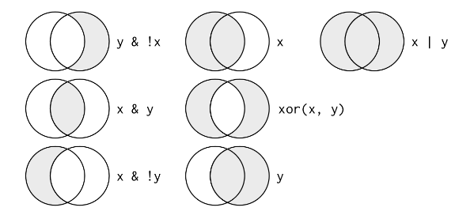
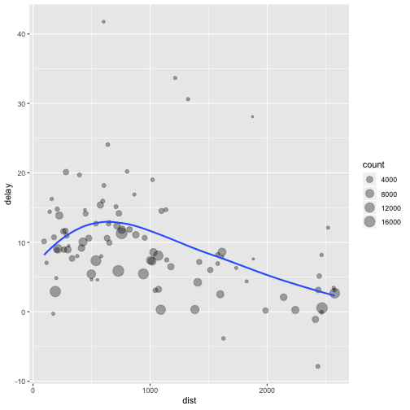

IPI R Workshop: Handling Data
========================================================
author: Carlos Calvo Hernandez 
date: December 5, 2018
autosize: true

Prerequisites
========================================================
- We're gonna use these libraries:

```r
library(nycflights13)
library(tidyverse)
```


Data: nycflights13
========================================================


```r
flights
```

```
# A tibble: 336,776 x 19
   year month   day dep_time sched_dep_time dep_delay arr_time
  <int> <int> <int>    <int>          <int>     <dbl>    <int>
1  2013     1     1      517            515         2      830
2  2013     1     1      533            529         4      850
3  2013     1     1      542            540         2      923
# ... with 3.368e+05 more rows, and 12 more variables:
#   sched_arr_time <int>, arr_delay <dbl>, carrier <chr>, flight <int>,
#   tailnum <chr>, origin <chr>, dest <chr>, air_time <dbl>,
#   distance <dbl>, hour <dbl>, minute <dbl>, time_hour <dttm>
```

dplyr Basics
========================================================

The "verbs" from ```dplyr``` package

```r
filter() #Pick observations by their values
arrange() #Reorder the rows
select() #Pick variables by their names
mutate() #Create new variables with functions of existing variables
summarize() #Collapse many values down to a single summary
```

Filter()
========================================================

- ```filter()``` allows to subset observations based on their values


```r
filter(flights, month == 12, day == 1)
```

```
# A tibble: 987 x 19
   year month   day dep_time sched_dep_time dep_delay arr_time
  <int> <int> <int>    <int>          <int>     <dbl>    <int>
1  2013    12     1       13           2359        14      446
2  2013    12     1       17           2359        18      443
3  2013    12     1      453            500        -7      636
# ... with 984 more rows, and 12 more variables: sched_arr_time <int>,
#   arr_delay <dbl>, carrier <chr>, flight <int>, tailnum <chr>,
#   origin <chr>, dest <chr>, air_time <dbl>, distance <dbl>, hour <dbl>,
#   minute <dbl>, time_hour <dttm>
```

Filter()
========================================================

- To save this result we need to assign the argument to a new data frame

```r
dec1 <- filter(flights, month == 12, day == 1)
```
- R either prints the results or saves them to a variable. To do both, wrap the assignment in parentheses


```r
(dec25 <- filter(flights, month == 12, day == 25))
```

Filter(): Comparisons
========================================================
incremental: true
- R handles the standard suite of comparison operators: >, <, >=, <=, !=, and ==

```
filter(flights, month = 1)
#> Error: `month` (`month = 1`) must not be named, do you need `==`?
```
- Weird points: Floating point numbers

```r
sqrt(2) ^ 2 == 2
```

```
[1] FALSE
```

Filter(): Comparisons
========================================================
incremental: true


```r
1 / 49 * 49 == 1
```

```
[1] FALSE
```

- Use ```near()``` instead


```r
near(sqrt(2) ^ 2, 2)
```

```
[1] TRUE
```

```r
near(1 / 49 * 49, 1)
```

```
[1] TRUE
```


Filter(): Logical Operators
========================================================

- Boolean Operator Cheatsheet: $ (and), | (or), ! (not)


- E.g.

```r
filter(flights, month == 11 & month == 12)
```

Filter(): Logical Operators
========================================================
incremental: true
- Lets say we want to find all flights that departed in November or December.

```r
filter(flights, month %in% c(11, 12))
```

```
# A tibble: 55,403 x 19
   year month   day dep_time sched_dep_time dep_delay arr_time
  <int> <int> <int>    <int>          <int>     <dbl>    <int>
1  2013    11     1        5           2359         6      352
2  2013    11     1       35           2250       105      123
3  2013    11     1      455            500        -5      641
# ... with 5.54e+04 more rows, and 12 more variables:
#   sched_arr_time <int>, arr_delay <dbl>, carrier <chr>, flight <int>,
#   tailnum <chr>, origin <chr>, dest <chr>, air_time <dbl>,
#   distance <dbl>, hour <dbl>, minute <dbl>, time_hour <dttm>
```

Filter(): Logical Operators
========================================================
- De Morgan's Law

```r
filter(flights, !(arr_delay > 120 | dep_delay > 120))

filter(flights, arr_delay <= 120, dep_delay <= 120)
```

- These two statements provide the same results.

Arrange()
========================================================

- Works similarly to ```filter()``` except that instead of selecting rows, it changes their order. It orders data sets by column names (or more complicated expressions)


```r
arrange(flights, year, month, day)
```

```
# A tibble: 336,776 x 19
   year month   day dep_time sched_dep_time dep_delay arr_time
  <int> <int> <int>    <int>          <int>     <dbl>    <int>
1  2013     1     1      517            515         2      830
2  2013     1     1      533            529         4      850
3  2013     1     1      542            540         2      923
# ... with 3.368e+05 more rows, and 12 more variables:
#   sched_arr_time <int>, arr_delay <dbl>, carrier <chr>, flight <int>,
#   tailnum <chr>, origin <chr>, dest <chr>, air_time <dbl>,
#   distance <dbl>, hour <dbl>, minute <dbl>, time_hour <dttm>
```


Arrange()
========================================================
- Use ```desc()``` to order in descending order


```r
arrange(flights, desc(dep_delay))
```

```
# A tibble: 336,776 x 19
   year month   day dep_time sched_dep_time dep_delay arr_time
  <int> <int> <int>    <int>          <int>     <dbl>    <int>
1  2013     1     9      641            900      1301     1242
2  2013     6    15     1432           1935      1137     1607
3  2013     1    10     1121           1635      1126     1239
# ... with 3.368e+05 more rows, and 12 more variables:
#   sched_arr_time <int>, arr_delay <dbl>, carrier <chr>, flight <int>,
#   tailnum <chr>, origin <chr>, dest <chr>, air_time <dbl>,
#   distance <dbl>, hour <dbl>, minute <dbl>, time_hour <dttm>
```

Select()
========================================================

- Allows to rapidly zoom in on useful subsets of variables using operations based on their names.


```r
#Select column by name
select(flights, year, month, day)
```

```
# A tibble: 336,776 x 3
   year month   day
  <int> <int> <int>
1  2013     1     1
2  2013     1     1
3  2013     1     1
# ... with 3.368e+05 more rows
```

Select()
========================================================

```r
#Select all columns between year and day (inclusive)
select(flights, year:day)
```

```
# A tibble: 336,776 x 3
   year month   day
  <int> <int> <int>
1  2013     1     1
2  2013     1     1
3  2013     1     1
# ... with 3.368e+05 more rows
```

Select()
========================================================


```r
#Select all columns except those from year to day (inclusive)
select(flights, -(year:day))
```

```
# A tibble: 336,776 x 16
  dep_time sched_dep_time dep_delay arr_time sched_arr_time arr_delay
     <int>          <int>     <dbl>    <int>          <int>     <dbl>
1      517            515         2      830            819        11
2      533            529         4      850            830        20
3      542            540         2      923            850        33
# ... with 3.368e+05 more rows, and 10 more variables: carrier <chr>,
#   flight <int>, tailnum <chr>, origin <chr>, dest <chr>, air_time <dbl>,
#   distance <dbl>, hour <dbl>, minute <dbl>, time_hour <dttm>
```

Select(): Helper Functions
========================================================


```r
starts_with("abc") #matches names that begin with "abc"
ends_with("xyz") #matches names that end with "xyz"
contains("ijk") #matches names that contain "ijk"
matches("(.)\\1") #selects variables that match a regular expression
num_range("x", 1:3) #matches x1, x2, and x3
```

Select(): Not dropping everything!
========================================================


```r
select(flights, time_hour, air_time, everything())
```

```
# A tibble: 336,776 x 19
  time_hour           air_time  year month   day dep_time sched_dep_time
  <dttm>                 <dbl> <int> <int> <int>    <int>          <int>
1 2013-01-01 05:00:00      227  2013     1     1      517            515
2 2013-01-01 05:00:00      227  2013     1     1      533            529
3 2013-01-01 05:00:00      160  2013     1     1      542            540
# ... with 3.368e+05 more rows, and 12 more variables: dep_delay <dbl>,
#   arr_time <int>, sched_arr_time <int>, arr_delay <dbl>, carrier <chr>,
#   flight <int>, tailnum <chr>, origin <chr>, dest <chr>, distance <dbl>,
#   hour <dbl>, minute <dbl>
```


Rename(): Select() little brother
========================================================

- ```rename()``` keeps all variables that aren't explicitly mentioned

```r
rename(flights, tail_num = tailnum)
```

```
# A tibble: 336,776 x 19
   year month   day dep_time sched_dep_time dep_delay arr_time
  <int> <int> <int>    <int>          <int>     <dbl>    <int>
1  2013     1     1      517            515         2      830
2  2013     1     1      533            529         4      850
3  2013     1     1      542            540         2      923
# ... with 3.368e+05 more rows, and 12 more variables:
#   sched_arr_time <int>, arr_delay <dbl>, carrier <chr>, flight <int>,
#   tail_num <chr>, origin <chr>, dest <chr>, air_time <dbl>,
#   distance <dbl>, hour <dbl>, minute <dbl>, time_hour <dttm>
```

Mutate()
========================================================

- Adds new variables that are functions of existing variables.


```r
flights_sml <- select(flights, year:day, ends_with("delay"), distance, air_time)

mutate(flights_sml, gain = dep_delay - arr_delay, speed = distance / air_time * 60)
```

```
# A tibble: 336,776 x 9
   year month   day dep_delay arr_delay distance air_time  gain speed
  <int> <int> <int>     <dbl>     <dbl>    <dbl>    <dbl> <dbl> <dbl>
1  2013     1     1         2        11     1400      227    -9  370.
2  2013     1     1         4        20     1416      227   -16  374.
3  2013     1     1         2        33     1089      160   -31  408.
# ... with 3.368e+05 more rows
```

Mutate()
========================================================


```r
mutate(flights_sml, gain = dep_delay - arr_delay, hours = air_time / 60, gain_per_hour = gain / hours)
```

```
# A tibble: 336,776 x 10
   year month   day dep_delay arr_delay distance air_time  gain hours
  <int> <int> <int>     <dbl>     <dbl>    <dbl>    <dbl> <dbl> <dbl>
1  2013     1     1         2        11     1400      227    -9  3.78
2  2013     1     1         4        20     1416      227   -16  3.78
3  2013     1     1         2        33     1089      160   -31  2.67
# ... with 3.368e+05 more rows, and 1 more variable: gain_per_hour <dbl>
```

Mutate()
========================================================
- To only keep the new variables:

```r
transmute(flights_sml, gain = dep_delay - arr_delay, hours = air_time / 60, gain_per_hour = gain / hours)
```

```
# A tibble: 336,776 x 3
   gain hours gain_per_hour
  <dbl> <dbl>         <dbl>
1    -9  3.78         -2.38
2   -16  3.78         -4.23
3   -31  2.67        -11.6 
# ... with 3.368e+05 more rows
```

Mutate(): Useful creating functions
========================================================

- Arithmetic operators: +, -, *, /, ^
- Modular arithmetic: %/% (integer division), %% (remainder).
- Logs: log(), log2(), log10()
- Offsets: lead(), and lag()
- Cumulative and running aggregates: cumsum(), cumprod(), cummin(), cummax(), and cummean().
- Logical comparisons: >, <, >=, <=, !=, and ==
- Ranking: min_rank(), row_number(x), ntile(x, n), dense_rank(x), percent_rank(x), and cume_dist(x)

Summarise()
========================================================

- Collapses a data frame to a single row


```r
summarise(flights, delay = mean(dep_delay, na.rm = TRUE))
```

```
# A tibble: 1 x 1
  delay
  <dbl>
1  12.6
```

- This is not terribly helpful. Introducing ```group_by()```

Summarise() and Group_by()
========================================================


```r
by_day <- group_by(flights, year, month, day)

summarise(by_day, delay = mean(dep_delay, na.rm = TRUE))
```

```
# A tibble: 365 x 4
# Groups:   year, month [?]
   year month   day delay
  <int> <int> <int> <dbl>
1  2013     1     1  11.5
2  2013     1     2  13.9
3  2013     1     3  11.0
# ... with 362 more rows
```

- Applied on a grouped data frame it'll be automatically applied "by group". Same with every ```dplyr``` verb.

The Pipe (again)
========================================================
- Lets explore the relationship between distance and average delay per location


```r
by_dest <- group_by(flights, dest)
delay <- summarise(by_dest,
  count = n(),
  dist = mean(distance, na.rm = TRUE),
  delay = mean(arr_delay, na.rm = TRUE)
)

delay <- filter(delay, count > 20, dest != "HNL")
```

The Pipe (again)
========================================================

```r
delay
```

```
# A tibble: 96 x 4
  dest  count  dist delay
  <chr> <int> <dbl> <dbl>
1 ABQ     254  1826  4.38
2 ACK     265   199  4.85
3 ALB     439   143 14.4 
# ... with 93 more rows
```

The Pipe (again)
========================================================


The Pipe (again)
========================================================

- Using a pipe

```r
delays <- flights %>% 
  group_by(dest) %>% 
  summarise(
    count = n(),
    dist = mean(distance, na.rm = TRUE),
    delay = mean(arr_delay, na.rm = TRUE)
  ) %>% 
  filter(count > 20, dest != "HNL")
```

***

- Not using a pipe

```r
by_dest <- group_by(flights, dest)
delay <- summarise(by_dest,
  count = n(),
  dist = mean(distance, na.rm = TRUE),
  delay = mean(arr_delay, na.rm = TRUE)
)

delay <- filter(delay, count > 20, dest != "HNL")
```

Missing values
========================================================

- ```na.rm = TRUE``` removes any missing value from the input before performing the aggregation and so omits it from the output.
- Removing the NAs (cancelled flights) first might be more useful. 

```r
not_cancelled <- flights %>% 
  filter(!is.na(dep_delay), !is.na(arr_delay))

not_cancelled %>% 
  group_by(year, month, day) %>% 
  summarise(mean = mean(dep_delay))
```

Summarise(): Useful summary functions
========================================================

- Measures of location: mean(x), median(x)
- Measures of spread: sd(x), IQR(x), mad(x) (median absolute deviation)
- Measures of rank: min(x), quantile(x, 0.25), max(x)
- Measures of position: first(x), nth(x), last(x)
- Counts: n(), sum(!is.na(x)), n_distinct(x)
- Proportions of logical values: sum(x > 10), mean(y == 0) 

Grouping by multiple variables
========================================================

- Grouping by multiple variables each summary peels off one level of the grouping


```r
daily <- group_by(flights, year, month, day)
(per_day <- summarise(daily, flights = n()))
```

```
# A tibble: 365 x 4
# Groups:   year, month [?]
   year month   day flights
  <int> <int> <int>   <int>
1  2013     1     1     842
2  2013     1     2     943
3  2013     1     3     914
# ... with 362 more rows
```

Grouping by multiple variables
========================================================


```r
(per_month <- summarise(per_day, flights = sum(flights)))
```

```
# A tibble: 12 x 3
# Groups:   year [?]
   year month flights
  <int> <int>   <int>
1  2013     1   27004
2  2013     2   24951
3  2013     3   28834
# ... with 9 more rows
```

Grouping by multiple variables
========================================================


```r
(per_year <- summarise(per_month, flights = sum(flights)))
```

```
# A tibble: 1 x 2
   year flights
  <int>   <int>
1  2013  336776
```

Ungroup()
========================================================
- To remove grouping and return to operation on ungrouped data

```r
daily %>%
  ungroup() %>% #removes grouping by date
  summarise(flights = n()) #all flights
```

```
# A tibble: 1 x 1
  flights
    <int>
1  336776
```

More examples
========================================================
source: Data_transformation.R /#Data Transformation Verbs for Dplyr/

Data_transformation.R in the Project folder
