IPI Workshop: GIS Introduction
========================================================
author: Carlos Calvo Hernandez
date: January 16, 2019
autosize: true

Libraries for Spatial Data
========================================================


```r
library(rgdal) #Importing and exporting vector data from other programs

library(sp) #Manipulate geographic data in vector format ("points, lines, polygons")

library(raster) #Manipulate geographic data in raster format ("grid data")

library(maptools) #Tools for handling spatial objects

library(tidyverse)
```
And many more...

Intro to GIS in R: Cheatsheets
========================================================

Based on Nick Eubank "GIS in R" [Tutorials](http://www.nickeubank.com/gis-in-r/)

- [Vector Data](http://www.nickeubank.com/wp-content/uploads/2015/10/gis_in_r_vector_cheatsheet.pdf)

- [Raster Data](http://www.nickeubank.com/wp-content/uploads/2015/10/gis_in_r_raster_cheatsheet.pdf)

- [Others](http://www.maths.lancs.ac.uk/~rowlings/Teaching/UseR2012/cheatsheet.html)

Introduction
========================================================

- There's two types of spatial data: vector and raster.

- Vector data includes: points, lines, or polygons.

- Raster data includes: "grid data"

- The **sp** package handles vector data and almost all spatial vector data structures in R are based on the **sp** package.

Introduction: Creating Spatial Data
========================================================

- There are three basic steps to creating spatial data by hand:
  1. Create geometric objects (points, lines, or polygons)
  2. Convert those geometric objects to `Spatial*` objects (* stands for Points, Lines, or Polygons)
      - Geometric objects live in an abstract space (the x-y plane). To make them spatial objects, we also need to include information on how those x-y coordinates relate the places in the real world using a Coordinate Reference System (CRS).
  3. (Optional:) Add a data frame with attribute data, which will turn your `Spatial*` object into a `Spatial*DataFrame` object.

Introduction: SpatialPoints
========================================================

- Points are the most basic geometric shape. `SpatialPoints` object in R.

- A points is defined by a pair of x-y coordiantes, so we can create a set of points by: 
    (a) creating matrix of x-y points, and 
    (b) passing them to the `SpatialPoints` function.


```r
toy.coordinates <- rbind(c(1.5, 2), c(2.5, 2), c(0.5, 0.5), c(1, 0.25), c(1.5, 
    0), c(2, 0), c(2.5, 0), c(3, 0.25), c(3.5, 0.5))
```

SpatialPoints: My first points
========================================================

```r
toy.coordinates
```

```
      [,1] [,2]
 [1,]  1.5 2.00
 [2,]  2.5 2.00
 [3,]  0.5 0.50
 [4,]  1.0 0.25
 [5,]  1.5 0.00
 [6,]  2.0 0.00
 [7,]  2.5 0.00
 [8,]  3.0 0.25
 [9,]  3.5 0.50
```

SpatialPoints
========================================================

```r
my.points <- SpatialPoints(toy.coordinates) #This converts the matrix into a spatial object
plot(my.points)
```


Information about SpatialPoints
========================================================


```r
coordinates(my.points)
```

```
      coords.x1 coords.x2
 [1,]       1.5      2.00
 [2,]       2.5      2.00
 [3,]       0.5      0.50
 [4,]       1.0      0.25
 [5,]       1.5      0.00
 [6,]       2.0      0.00
 [7,]       2.5      0.00
 [8,]       3.0      0.25
 [9,]       3.5      0.50
```
***

```r
summary(my.points)
```

```
Object of class SpatialPoints
Coordinates:
          min max
coords.x1 0.5 3.5
coords.x2 0.0 2.0
Is projected: NA 
proj4string : [NA]
Number of points: 9
```


Coordinate Reference System (CRS)
========================================================
- Coordinate Reference System (CRS): the combination of a geographic coordinate system (and possibly a projection).


```r
summary(my.points)
```

```
Object of class SpatialPoints
Coordinates:
          min max
coords.x1 0.5 3.5
coords.x2 0.0 2.0
Is projected: NA 
proj4string : [NA]
Number of points: 9
```

-The ***Spatial*** object we just created does not have a projection or geographic coordinate system defined.

CRS Objects
========================================================

- CRS objects can be created by passing the `CRS()` function. 
- [Common projections](http:/www.spatialreference.org)
- Example: CRS is the WGS84 latitude-longitude projection.
- Call: `CRS("+init=EPSG:4326")` 
- or  `CRS("+proj=longlat +ellps=WGS84 +datum=WGS84 +no_defs")`.

Example: Assigning a CRS
========================================================

```r
is.projected(my.points)  # see if a projection is defined.
```

```
[1] NA
```

```r
crs.geo <- CRS("+init=EPSG:32633")  # UTM 33N
proj4string(my.points) <- crs.geo  # define projection system of our data
is.projected(my.points)
```

```
[1] TRUE
```


Example: Checking the CRS assignment
========================================================

```r
summary(my.points)
```

```
Object of class SpatialPoints
Coordinates:
          min max
coords.x1 0.5 3.5
coords.x2 0.0 2.0
Is projected: TRUE 
proj4string :
[+init=EPSG:32633 +proj=utm +zone=33 +datum=WGS84 +units=m +no_defs
+ellps=WGS84 +towgs84=0,0,0]
Number of points: 9
```


EPSG code arguments
========================================================

```r
crs.geo <- CRS("+init=EPSG:32633")  # looks up UTM 33N
crs.geo  # prints all parameters
```

```
CRS arguments:
 +init=EPSG:32633 +proj=utm +zone=33 +datum=WGS84 +units=m +no_defs
+ellps=WGS84 +towgs84=0,0,0 
```


Adding attributes
========================================================
- This changes the object from `SpatialPoints` to `SpatialPointsDataFrame`

```r
df <- data.frame(attr1 = c("a", "b", "z", "d", "e", "q", "w", "r", "z"), attr2 = c(101:109))
df
```

```
  attr1 attr2
1     a   101
2     b   102
3     z   103
4     d   104
5     e   105
6     q   106
7     w   107
8     r   108
9     z   109
```


Adding attributes (cont.)
========================================================

```r
my.spdf <- SpatialPointsDataFrame(my.points, df)
summary(my.spdf)
```

```
Object of class SpatialPointsDataFrame
Coordinates:
          min max
coords.x1 0.5 3.5
coords.x2 0.0 2.0
Is projected: TRUE 
proj4string :
[+init=EPSG:32633 +proj=utm +zone=33 +datum=WGS84 +units=m +no_defs
+ellps=WGS84 +towgs84=0,0,0]
Number of points: 9
Data attributes:
     attr1       attr2    
 z      :2   Min.   :101  
 a      :1   1st Qu.:103  
 b      :1   Median :105  
 d      :1   Mean   :105  
 e      :1   3rd Qu.:107  
 q      :1   Max.   :109  
 (Other):2                
```

Subsetting attributes
========================================================

```r
my.spdf[1:2,] #row 1 and 2 only
```

```
class       : SpatialPointsDataFrame 
features    : 2 
extent      : 1.5, 2.5, 2, 2  (xmin, xmax, ymin, ymax)
coord. ref. : +init=EPSG:32633 +proj=utm +zone=33 +datum=WGS84 +units=m +no_defs +ellps=WGS84 +towgs84=0,0,0 
variables   : 2
names       : attr1, attr2 
min values  :     a,   101 
max values  :     b,   102 
```

Subsetting attributes (cont.)
========================================================

```r
my.spdf[1:2, "attr1"]
```

```
class       : SpatialPointsDataFrame 
features    : 2 
extent      : 1.5, 2.5, 2, 2  (xmin, xmax, ymin, ymax)
coord. ref. : +init=EPSG:32633 +proj=utm +zone=33 +datum=WGS84 +units=m +no_defs +ellps=WGS84 +towgs84=0,0,0 
variables   : 1
names       : attr1 
min values  :     a 
max values  :     b 
```

Plotting `SpatialPointsDataFrame`
========================================================

```r
plot(my.spdf[which(my.spdf$attr2 > 105), ])
```

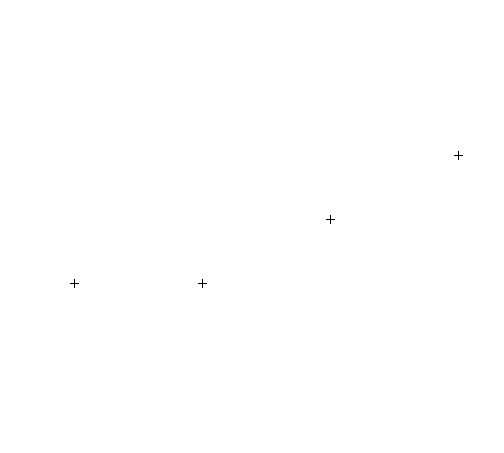


`SpatialPoint` from a lat/long table
========================================================
source: GIS.R /#1.1 SpatialPoint from lat/long table/

- See the GIS.R file for an example

`SpatialPolygons`: The real deal
========================================================
- `SpatialPolygons` objects are a different class of R objects
- They are comprised of:
    1. `Polygon` objects: single geometric shape (e.g. a square, rectangle, etc.) defined by a single uninterrupted line around the exterior of the shape.
    2. `Polygons` objects consist of one or more simple geometric objects (Polygon objects) that combine to form what you think of as a single unit of analysis (an “observation”).
    3. A `SpatialPolygons` object is a collection of `Polygons` objects, where each `Polygons` object is an “observation”.
    

`SpatialPolygon` Objects
========================================================

```r
# create polyon objects from coordinates. Each object is a single geometric polygon defined by a bounding line.
house1.building <- Polygon(rbind(c(1, 1), c(2, 1), c(2, 0), c(1, 0)))

house1.roof <- Polygon(rbind(c(1, 1), c(1.5, 2), c(2, 1)))

house2.building <- Polygon(rbind(c(3, 1), c(4, 1), c(4, 0), c(3, 0)))

house2.roof <- Polygon(rbind(c(3, 1), c(3.5, 2), c(4, 1)))

house2.door <- Polygon(rbind(c(3.25, 0.75), c(3.75, 0.75), c(3.75, 0), c(3.25, 
    0)), hole = TRUE)
```


`SpatialPolygon` Objects
========================================================

```r
# create lists of polygon objects from polygon objects and unique ID A `Polygons` is like a single observation.
h1 <- Polygons(list(house1.building, house1.roof), "house1")
h2 <- Polygons(list(house2.building, house2.roof, house2.door), "house2")
```

`SpatialPolygon` Objects
========================================================

```r
# create spatial polygons object from lists A SpatialPolygons is like a shapefile or layer.
houses <- SpatialPolygons(list(h1, h2))
plot(houses)
```

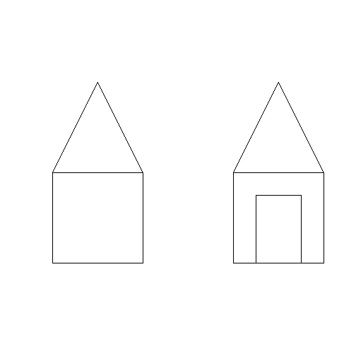

Adding attributes to `SpatialPolygons` objects
========================================================
- Same as with `SpatialPoints` we can associate a Data Frame

```r
attr <- data.frame(attr1 = 1:2, attr2 = 6:5, row.names = c("house2", "house1"))
houses.DF <- SpatialPolygonsDataFrame(houses, attr)
as.data.frame(houses.DF)  # Notice the rows were re-ordered!
```

```
       attr1 attr2
house1     2     5
house2     1     6
```

Adding attributes to `SpatialPolygons` objects
========================================================

```r
spplot(houses.DF) #spplot plots a raster object
```

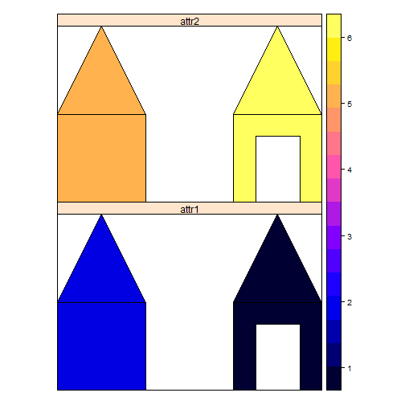


Importing and exporting spatial data using `rgdal`
========================================================
- Usually you are not going to create `Spatial*` objects. 
- We can read in and write out data using `readOGR()` and `writeOGR()`
- Th exact parameters depend on the type of file you are using.
- `readOGR()` expects at least:

```
datasource name (dsn)  # the path to the folder that contains the files. Note that this is a path to the folder
layer name (layer)     # the file name without extension. Note that this is not a path but just the name of the file
```

Importing and exporting spatial data using `rgdal` (Example)
========================================================

```r
sf <- readOGR(dsn = "RGIS1_Data/shapefiles", layer = "sf_incomes")
```

```
OGR data source with driver: ESRI Shapefile 
Source: "C:\Users\bialeks\Box\R Workshop\Week 4 - GIS\RGIS1_Data\shapefiles", layer: "sf_incomes"
with 182 features
It has 3 fields
Integer64 fields read as strings:  Trc2000 
```

Importing and exporting spatial data using `rgdal` (Example)
========================================================

```r
summary(sf)
```

```
Object of class SpatialPolygonsDataFrame
Coordinates:
      min     max
x 5979386 6024741
y 2085841 2131294
Is projected: TRUE 
proj4string :
[+proj=lcc +lat_1=37.06666666666667 +lat_2=38.43333333333333
+lat_0=36.5 +lon_0=-120.5 +x_0=2000000 +y_0=500000.0000000002
+datum=NAD83 +units=us-ft +no_defs +ellps=GRS80 +towgs84=0,0,0]
Data attributes:
    Trc2000       MdIncHH          MdIncPC      
 10100  :  3   Min.   :     0   Min.   :     0  
 17901  :  3   1st Qu.: 53647   1st Qu.: 26103  
 12600  :  2   Median : 72702   Median : 40395  
 60900  :  2   Mean   : 73015   Mean   : 45901  
 10200  :  1   3rd Qu.: 94845   3rd Qu.: 61839  
 10300  :  1   Max.   :164135   Max.   :125777  
 (Other):170                                    
```

Importing and exporting spatial data using `rgdal` (Example)
========================================================

```r
head(as.data.frame(sf))
```

```
  Trc2000 MdIncHH MdIncPC
0   26404   40660   14268
1   26303   84471   23306
2   60502   21270   10902
3   26403   51176   18543
4   26401   59583   17240
5   26302   62333   25166
```

Importing and exporting spatial data using `rgdal` (Example)
========================================================
- Subsetting works here too!

```r
sf[sf$MdIncHH > 40000, ]
```

```
class       : SpatialPolygonsDataFrame 
features    : 157 
extent      : 5979386, 6024741, 2085841, 2131294  (xmin, xmax, ymin, ymax)
coord. ref. : +proj=lcc +lat_1=37.06666666666667 +lat_2=38.43333333333333 +lat_0=36.5 +lon_0=-120.5 +x_0=2000000 +y_0=500000.0000000002 +datum=NAD83 +units=us-ft +no_defs +ellps=GRS80 +towgs84=0,0,0 
variables   : 3
names       : Trc2000, MdIncHH, MdIncPC 
min values  :   10100,   40660,   13655 
max values  :   61000,  164135,  125777 
```

Importing and exporting spatial data using `rgdal` (Example)
========================================================

```r
spplot(sf, "MdIncHH")
```

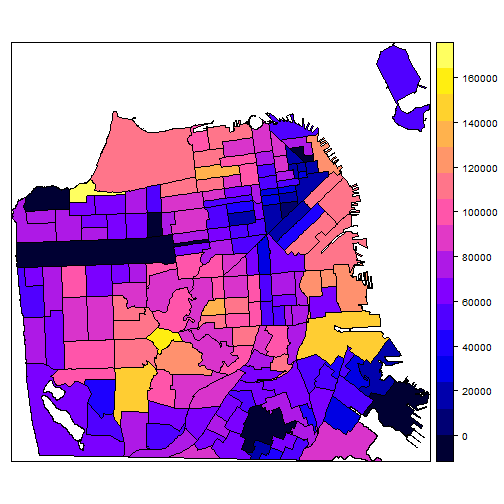

Creating maps in R
========================================================
- There are many package created to design plots in R.
- The most basic ones are: 


```r
plot #plots shapes associated with Spatial* or Raster objects
spplot #plots shapes associated with Spatial* or Raster objects AND colors them according to an attribute in the respective Data Frame
```

Using plot
========================================================

```r
palo_alto <- readOGR("RGIS3_Data/palo_alto", "palo_alto")
```

```
OGR data source with driver: ESRI Shapefile 
Source: "C:\Users\bialeks\Box\R Workshop\Week 4 - GIS\RGIS3_Data\palo_alto", layer: "palo_alto"
with 371 features
It has 5 fields
```

Using plot
========================================================

```r
plot(palo_alto)
```

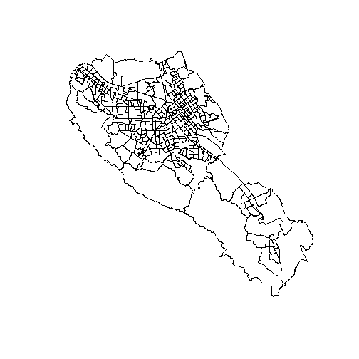

Using plot
========================================================

```r
plot(palo_alto, border = "red")
title(main = "Palo Alto", sub = "By Census Tracts")
```

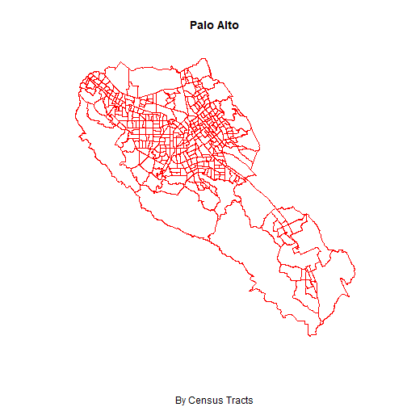

Other features with plot
========================================================

```r
freeways <- readOGR("RGIS3_Data/palo_alto", "palo_alto_freeways")
```

```
OGR data source with driver: ESRI Shapefile 
Source: "C:\Users\bialeks\Box\R Workshop\Week 4 - GIS\RGIS3_Data\palo_alto", layer: "palo_alto_freeways"
with 955 features
It has 45 fields
Integer64 fields read as strings:  URBAN_CODE RECID ORIGID LGURB SMURB 
```

Other features with plot
========================================================

```r
par(mfrow = c(1, 2))
plot(freeways, col = "red", bg = "blue")
plot(freeways, lwd = 10, col = "green")
```

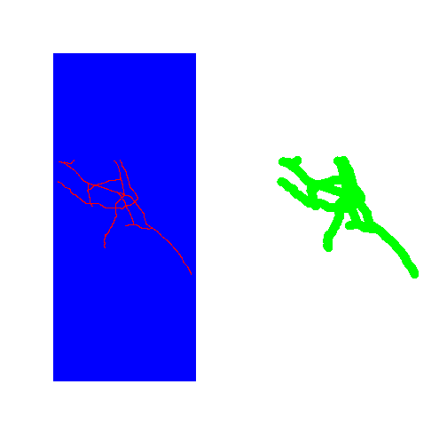

Multiple layers with plot
========================================================

```r
stopifnot(proj4string(palo_alto) == proj4string(freeways))  # Check in same projection before combining!

plot(palo_alto)
plot(freeways, col = "blue", add = T)
```

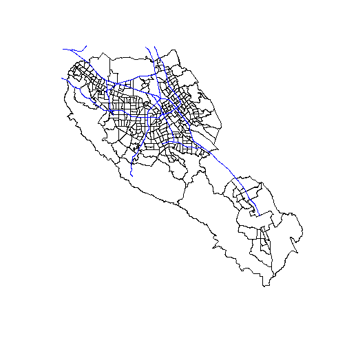

Using spplot
========================================================
- `spplot` is an extension of `plot` very useful for filling in polygons ("chloropleth maps").
- It chooses the colors based on the attributes in an associated Data Frame.

```r
spplot(palo_alto, "PrCpInc", main = "Palo Alto Demographics", sub = "Average Per Capita Income", 
    col = "transparent")
```
- Note the `col= "transparent"` option just suppresses the borders

Using spplot
========================================================


Using spplot: Parameters
========================================================
- Lets say that we want to zoom to a specific section of Palo Alto, and not the default.

```r
# Change these parameters
scale.parameter = 0.5  # scaling parameter. Less than 1 is zooming in, more than 1 zooming out. 
xshift = -0.1  # Shift to right in map units. 
yshift = 0.2  # Shift to left in map units. 
original.bbox = palo_alto@bbox  # Pass bbox of your Spatial* Object. 

edges = original.bbox

edges[1, ] <- (edges[1, ] - mean(edges[1, ])) * scale.parameter + mean(edges[1, ]) + xshift

edges[2, ] <- (edges[2, ] - mean(edges[2, ])) * scale.parameter + mean(edges[2, ]) + yshift
```

Using spplot: Parameters
========================================================

```r
spplot(palo_alto, "PrCpInc", main = "Palo Alto Demographics", sub = "Average Per Capita Income", col = "transparent", xlim = edges[1, ], ylim = edges[2, ])
```
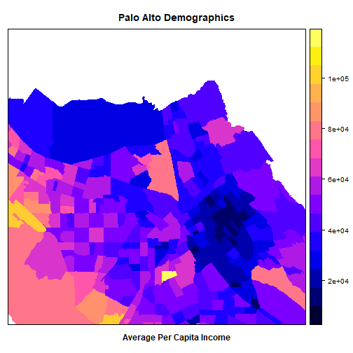


Controlling colors
========================================================
- `RColorBrewer` is a great source of alternative palettes and colors

```r
require(RColorBrewer)
display.brewer.all()
```

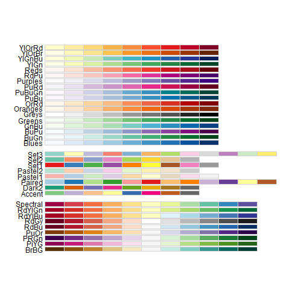

Controlling colors: My palette
========================================================

```r
my.palette <- brewer.pal(n = 7, name = "OrRd")
spplot(palo_alto, "PrCpInc", col.regions = my.palette, cuts = 6, col = "transparent")
```

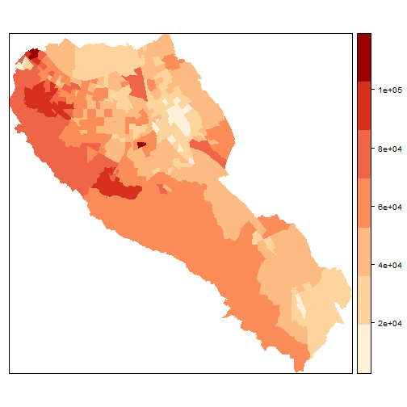

Multiple layers with spplot
========================================================
-`spplot` allows users to add multiple layers or symbols using the `sp.layout` argument
- To use `sp.layout` we create a list where:
    1. The first item is the type of layer to add.
    2. The second argument is the actual layer we want to plot.
    3. Any following items are plotting options.
    

```r
# Create a layer-list
freeway.layer <- list("sp.lines", freeways, col = "green")

# Plot with layer-list passed to `sp.layout`
spplot(palo_alto, "PrCpInc", sp.layout = freeway.layer, col = "transparent")
```
    
Multiple layers with spplot
========================================================
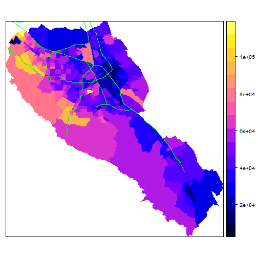

Multiple layers with spplot
========================================================
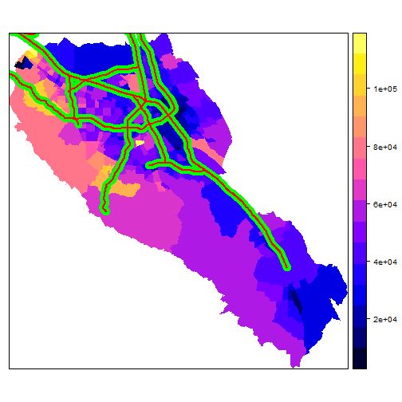

Dot-density plots with maptools
========================================================

```r
library(maptools)

# Get census polygons
census <- readOGR("RGIS3_data/palo_alto", "palo_alto")
```

```
OGR data source with driver: ESRI Shapefile 
Source: "C:\Users\bialeks\Box\R Workshop\Week 4 - GIS\RGIS3_data\palo_alto", layer: "palo_alto"
with 371 features
It has 5 fields
```


Dot-density plots with maptools
========================================================


```r
# Get feel for data with white population (largest group)
spplot(census, "White")
```

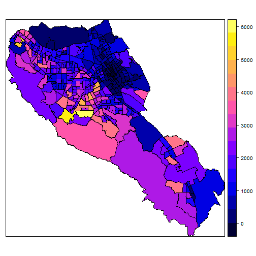


Dot-density plots with maptools
========================================================

```r
# Setting a seed is a good idea -- since points are random, it's helpful for replication to make sure this code will always make the same result.
set.seed(47)

# Create a fixed number of points at random locations within each polygon based on a polygon variable. Since the field values here are the number of people, we can get one dot per 300 people as follows:
people.per.dot = 700

dots.w <- dotsInPolys(census, as.integer(census$White/people.per.dot))
dots.w$ethnicity <- "White"

dots.h <- dotsInPolys(census, as.integer(census$hispanc/people.per.dot))
dots.h$ethnicity <- "Hispanic"
```

Dot-density plots with maptools
========================================================

```r
# Gather all the dots into a single SpatialPoints
dots.all <- rbind(dots.w, dots.h)
proj4string(dots.all) <- CRS(proj4string(palo_alto))

# Since ethnicity is a string, order is alphabetical. You can change if you want by making these categoricals!
my.palette <- c("red", "blue")
point.size <- 0.5

# Make sure stored as a factor
dots.all$ethnicity <- as.factor(dots.all$ethnicity)


# Make sp.layout list for the actually boundaries
census.tract.layer <- list("sp.polygons", census)
```


Dot-density plots with maptools
========================================================

```r
spplot(dots.all, "ethnicity", sp.layout = census.tract.layer, col.regions = my.palette, cex = point.size, main = "Demographic Distribution of Santa Clara County")
```
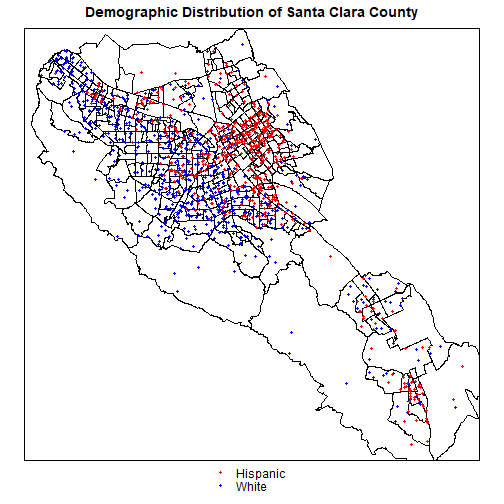

Basemaps
========================================================
- Both `plot` and `spplot` can suppot overlaying `Spatial*` objects over basemaps, with differing degrees of difficulty.
- Warning: Almost all basemaps you will get from common sources (like google maps) use a very special projection – WGS84 Web Mercator (EPSG:3857). If you use a tool like ggmap, be very careful with this, as the maps it generates are in latitudes and longitudes (which makes you think it’s regular WGS84), but if treated as WGS84 you will have severe alignment problems.

Basemaps with plot
========================================================


```
Error in library(ggmap) : there is no package called 'ggmap'
```
